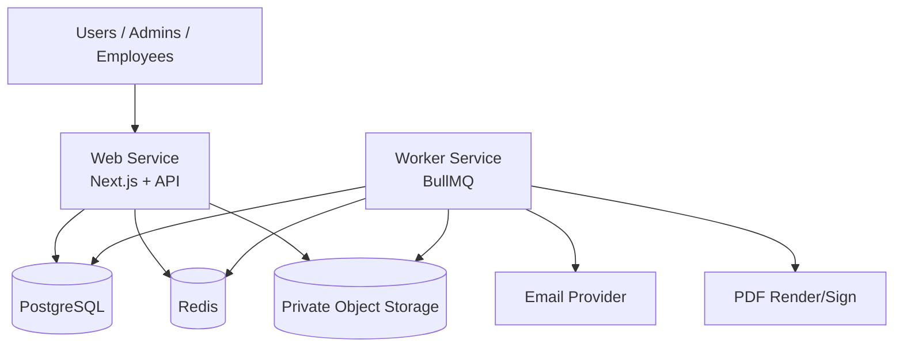

# Deployment Audit

Date: 2025-09-07

## Repository inspection summary

This repository currently ships the **Nova Workforce marketing website** (Next.js App Router, Tailwind CSS, contact form API). The uploaded deployment brief targets a broader **payroll and salary-slip portal** with PostgreSQL, Redis, BullMQ workers, object storage, email, and PDF services.

This audit documents what exists today, what was added for Railway deployment, and what still must be built for the full payroll platform.

## Existing services and scripts

| Component | Status | Notes |
|-----------|--------|-------|
| Next.js web app | Present | Marketing pages + `/api/contact` |
| API health endpoint | Added | `/api/health` with optional DB/Redis checks |
| PostgreSQL / Prisma | Scaffolded | Minimal `DeploymentBootstrap` model + initial migration |
| Redis / BullMQ worker | Scaffolded | Separate `worker/index.ts` with graceful shutdown + health server |
| Queue idempotency keys | Added | Centralized in `lib/queue/idempotency.ts` |
| Object storage integration | Missing | Env keys documented only |
| Email delivery integration | Missing | Contact route logs only |
| PDF generation/signing | Missing | Worker handlers are placeholders |
| Auth / sessions / OTP | Missing | Env keys documented only |
| Railway config | Added | `railway.toml`, Dockerfile, scripts |
| GitHub Actions CI | Added | Lint, typecheck, test, build on PRs |

### Package scripts (after this change)

- `npm run dev` — local development
- `npm run build` — Prisma generate + Next.js production build
- `npm start` — production web server (`0.0.0.0`, Railway `PORT`)
- `npm run worker:start` — BullMQ worker process
- `npm run db:migrate:deploy` — production-safe Prisma migrations
- `npm run lint`, `npm run typecheck`, `npm test`

## Required missing infrastructure

These are **not yet implemented** in application code and must be built before the portal is functionally complete:

1. Domain models for companies, employees, payroll runs, payslips, statements
2. Authentication, OTP, and encrypted sessions
3. S3-compatible private object storage adapters for statements and PDFs
4. Email provider integration (OTP + payslip delivery)
5. PDF rendering/signing pipeline (Playwright/Puppeteer or equivalent)
6. Admin/employee dashboards and secure download authorization
7. Audit logging tied to worker job lifecycle
8. Staging-safe email guardrails

## Required environment variables

See `.env.example` for the full key list (keys only, no values).

### Generated automatically by `scripts/railway-set-variables.sh`

- `AUTH_SECRET`
- `SESSION_ENCRYPTION_KEY`
- `OTP_PEPPER`
- `PDF_ENCRYPTION_MASTER_KEY`

### Obtained from Railway service references

- `DATABASE_URL` → `${{Postgres.DATABASE_URL}}`
- `DIRECT_URL` → `${{Postgres.DATABASE_URL}}` (or dedicated direct URL if configured)
- `REDIS_URL` → `${{Redis.REDIS_URL}}`

### Must be supplied manually

- `APP_URL`, `NEXT_PUBLIC_APP_URL`, `COOKIE_DOMAIN`
- Object storage: `S3_*`
- Email: `EMAIL_PROVIDER`, `EMAIL_API_KEY`, `EMAIL_FROM`, `EMAIL_REPLY_TO`
- PDF signing (if enabled): `PDF_SIGNING_PRIVATE_KEY`, `PDF_SIGNING_CERTIFICATE`
- Optional monitoring: `SENTRY_DSN`

## Deployment assumptions

1. Railway project with **separate services**: `web`, `worker`, PostgreSQL, Redis.
2. Both `web` and `worker` deploy from the **same repository**.
3. Web uses Docker/`railway.toml` health check at `/api/health`.
4. Worker uses `npm run worker:start` and internal health on port `8081`.
5. Migrations run **once per deployment** via `scripts/railway-migrate.sh`, not from every web replica.
6. Production migrations use **`prisma migrate deploy` only** (never `db push` or reset).
7. Durable files are stored in external S3-compatible object storage, not Railway disk.
8. Staging must not email real employees unless explicitly enabled in application logic.

## Blocking manual configuration

Complete these in Railway Dashboard before first production deploy:

1. Create/link Railway project and environments (`development`, `staging`, `production`).
2. Add PostgreSQL and Redis services; wire variable references to web + worker.
3. Create `web` and `worker` services with correct start commands.
4. Configure custom domain + HTTPS for the web service.
5. Provision object storage bucket and credentials.
6. Configure email provider and verified sender domain.
7. Add GitHub secret `RAILWAY_TOKEN` only if using automated Railway deploy workflows.

## Railway service architecture

## Known limitations

- Worker job handlers are placeholders until payroll domain logic is implemented.
- PDF browser dependencies are documented but not yet installed in Docker (add when PDF stack is chosen).
- Worker health endpoint is internal (`WORKER_HEALTH_PORT`); public worker health requires Railway networking configuration.
- The marketing site can deploy to Railway as the web service today; full portal features require additional application development.
