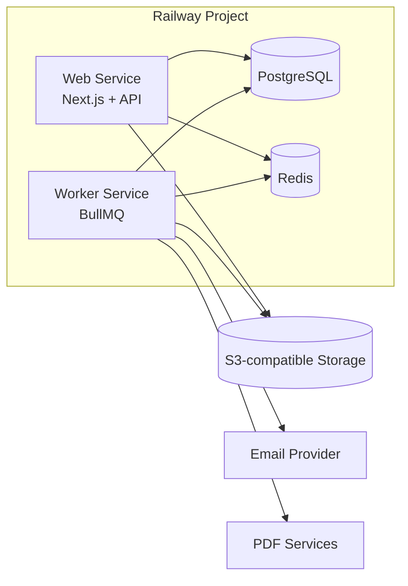

# Railway Deployment Guide

This guide deploys the Nova Workforce platform to Railway with separate **web**, **worker**, **PostgreSQL**, and **Redis** services.

> See `DEPLOYMENT_AUDIT.md` for current repository capabilities vs. the full payroll portal roadmap.

## Architecture



## Prerequisites

- Railway account and project
- Railway CLI installed (`npm i -g @railway/cli`)
- Node.js 20+ locally
- S3-compatible object storage bucket
- Email provider account (Resend, SendGrid, SES, etc.)
- Optional: custom domain, Sentry project

## Initial Railway Dashboard setup

1. Create a Railway project.
2. Create environments: `development`, `staging`, `production`.
3. Add **PostgreSQL** and **Redis** plugins/services.
4. Create two application services from the same repo:
   - `web` — start command: `npm start` (or Docker default `node server.js`)
   - `worker` — start command: `npm run worker:start`
5. Attach repo and set branch per environment policy.
6. Configure health check for web: path `/api/health`, timeout 120s.
7. Add custom domain to web service (production).

## Local environment setup

```bash
npm ci
cp .env.example .env.development.local
# Fill required keys locally (never commit this file)
npm run dev
```

For worker locally (requires Redis):

```bash
npm run worker:start
```

## Secure variable setup

Recommended flow:

```bash
./scripts/railway-setup.sh
./scripts/railway-set-variables.sh staging
```

Variable rules:

- `.env.production.local`, `.env.staging.local`, `.env.development.local` are gitignored.
- `.env.example` contains keys only.
- Scripts print variable **names**, never values.
- Auto-generated secrets are written only to your local ignored env file.

### Auto-generated secrets

- `AUTH_SECRET`
- `SESSION_ENCRYPTION_KEY`
- `OTP_PEPPER`
- `PDF_ENCRYPTION_MASTER_KEY`

### Manual secrets you must provide

- Object storage credentials (`S3_*`)
- Email provider (`EMAIL_*`)
- Public URLs (`APP_URL`, `NEXT_PUBLIC_APP_URL`, `COOKIE_DOMAIN`)
- PDF signing cert/key if real signing is enabled
- Optional `SENTRY_DSN`

## Staging deployment

```bash
./scripts/railway-setup.sh
./scripts/railway-set-variables.sh staging
./scripts/railway-migrate.sh staging
./scripts/railway-deploy.sh staging
./scripts/railway-healthcheck.sh staging
```

## Production deployment

```bash
./scripts/railway-set-variables.sh production
./scripts/railway-migrate.sh production
./scripts/railway-deploy.sh production
./scripts/railway-healthcheck.sh production
```

Production prompts require explicit confirmation in migrate/deploy scripts.

## Database migration procedure

- Uses `prisma migrate deploy` via `scripts/railway-migrate.sh`.
- Safe optional seed: `./scripts/railway-migrate.sh staging --seed`
- Never uses `prisma db push`, `migrate reset`, or destructive commands in staging/production.
- Run migrations once per deployment, not from every horizontally scaled web instance.

## Rollback procedure

1. In Railway Dashboard, open the affected service (`web` or `worker`).
2. Select **Deployments** and redeploy the last known-good deployment.
3. If a migration caused the issue, restore PostgreSQL from backup (see below) or deploy a fixed migration forward — do not run reset in production.
4. Re-run `./scripts/railway-healthcheck.sh <environment>`.

## Monitoring and logs

- Railway service logs: Dashboard → Service → Logs
- Web health: `GET /api/health`
- Worker health: internal `http://0.0.0.0:8081/` (requires service networking or `railway run` diagnostics)
- Optional Sentry: set `SENTRY_DSN` on web + worker

## Backup and restore

### PostgreSQL

- Enable Railway PostgreSQL backups in Dashboard where available.
- For manual backup: use `railway run pg_dump ...` from a linked shell with database credentials.
- Restore to a new database instance first, validate, then swap `DATABASE_URL` references.

### Object storage

- Enable bucket versioning/lifecycle policies at your storage provider.
- Periodically export critical prefixes (`statements/`, `payslips/`, `templates/`).
- Restore by copying objects back to the bucket and verifying signed download flows.

## Troubleshooting

| Symptom | Likely cause | Fix |
|---------|--------------|-----|
| Log shows `unpacking archive` then failure | Builder mismatch (Dockerfile selected but missing), or truncated logs | Ensure PR #2 is merged; default builder is Nixpacks. Check logs after that line for `[err]` |
| Database connection errors | Missing/incorrect `DATABASE_URL` reference | Attach Postgres plugin; set `${{Postgres.DATABASE_URL}}` on web + worker |
| Prisma migration failure | Drift or missing migration history | Inspect migration logs; deploy fix forward; avoid reset in prod |
| Redis connection failure | Missing `REDIS_URL` or TLS mismatch | Set `${{Redis.REDIS_URL}}`; verify `rediss://` TLS options |
| Worker not processing jobs | Worker service down or Redis unreachable | Check worker logs; confirm `npm run worker:start` and Redis URL |
| PDF browser dependency failure | Missing OS libraries in image | Add Playwright/Puppeteer system deps to Dockerfile when implemented |
| Email failure | Invalid API key or unverified sender | Verify provider credentials and staging safety flags |
| Object storage access denied | Wrong bucket policy/keys | Validate `S3_*` vars and IAM/bucket ACL |

## GitHub Actions CI

Workflow: `.github/workflows/ci.yml`

Runs on pull requests:

- `npm ci`
- lint
- typecheck
- tests
- production build

It does **not** auto-deploy production. For Railway deploy automation, add GitHub secret:

- `RAILWAY_TOKEN` — Railway project token with deploy permissions

## Windows PowerShell equivalents

```powershell
# Setup
bash ./scripts/railway-setup.sh

# Variables
bash ./scripts/railway-set-variables.sh staging

# Migrate
bash ./scripts/railway-migrate.sh staging

# Deploy
bash ./scripts/railway-deploy.sh staging

# Health
bash ./scripts/railway-healthcheck.sh staging
```

Use WSL or Git Bash for best compatibility with `set -euo pipefail` scripts.

## Security notes

- Never place secrets in `NEXT_PUBLIC_*` variables.
- Use HTTPS and secure cookies in production (`COOKIE_DOMAIN`, `APP_URL`).
- Configure object storage CORS for signed downloads only.
- Redact OTPs, passwords, PAN, bank accounts, and salary values in logs (`lib/log-redaction.ts`).
- Keep staging email delivery disabled for real employee addresses unless explicitly enabled in code.
